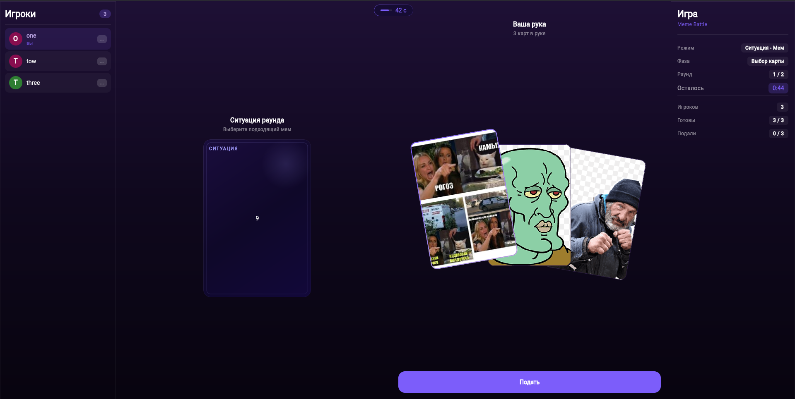
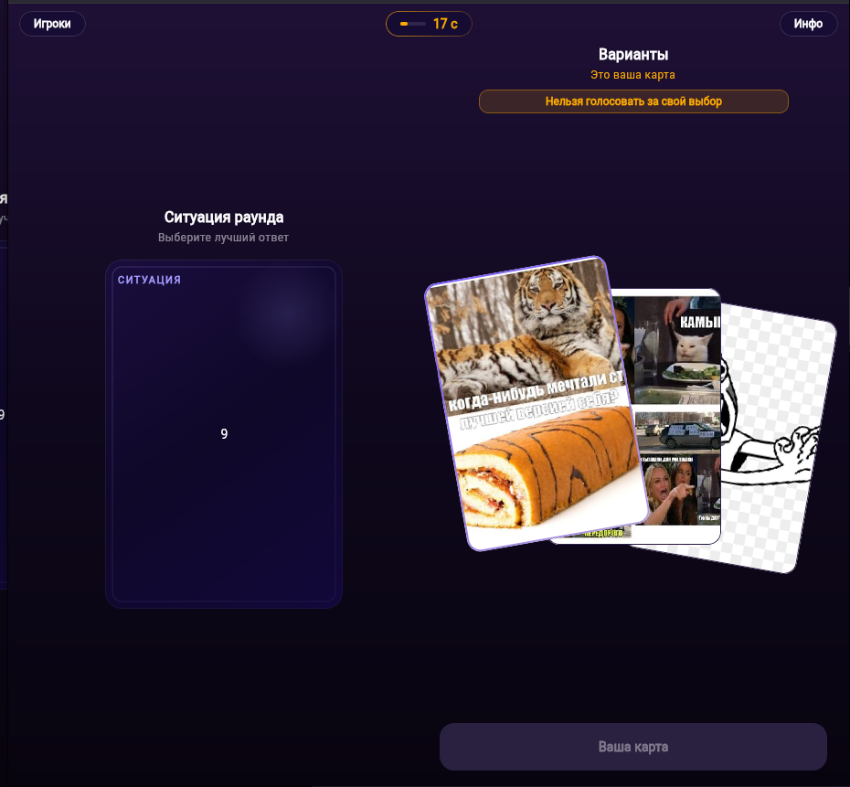
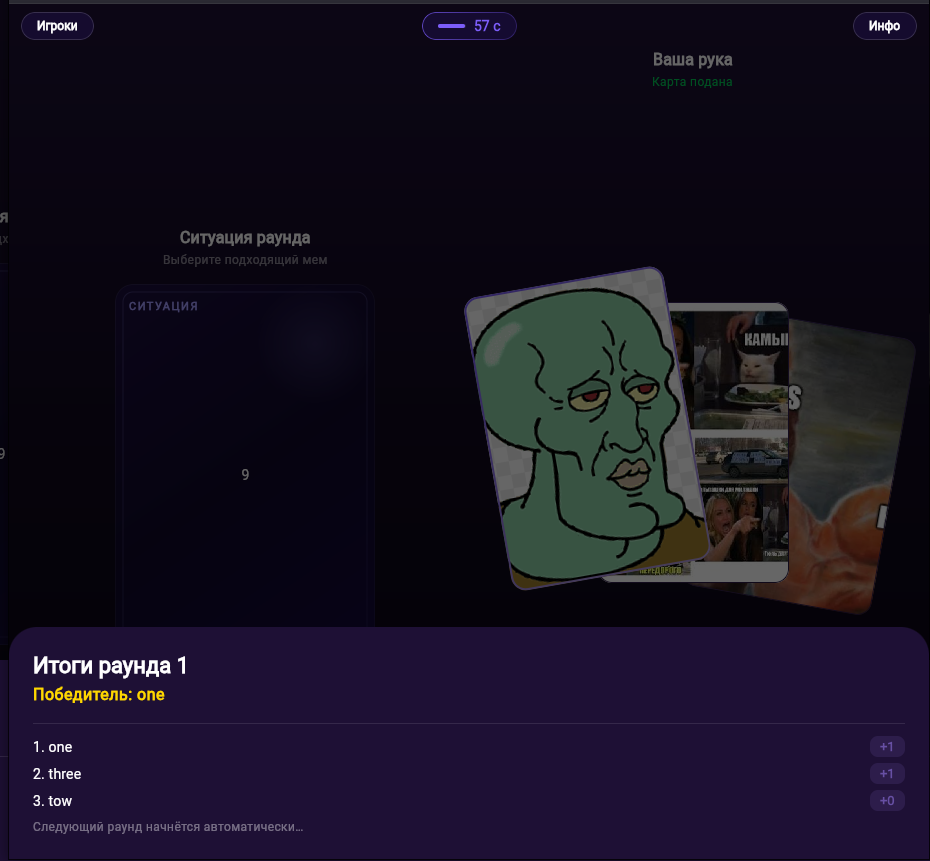
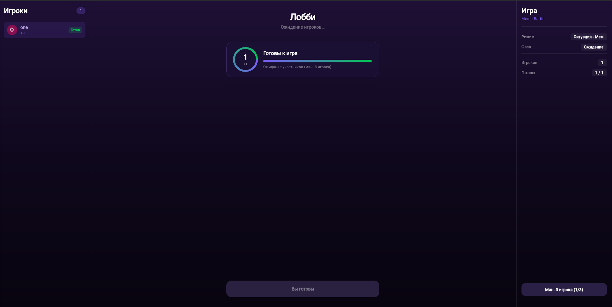
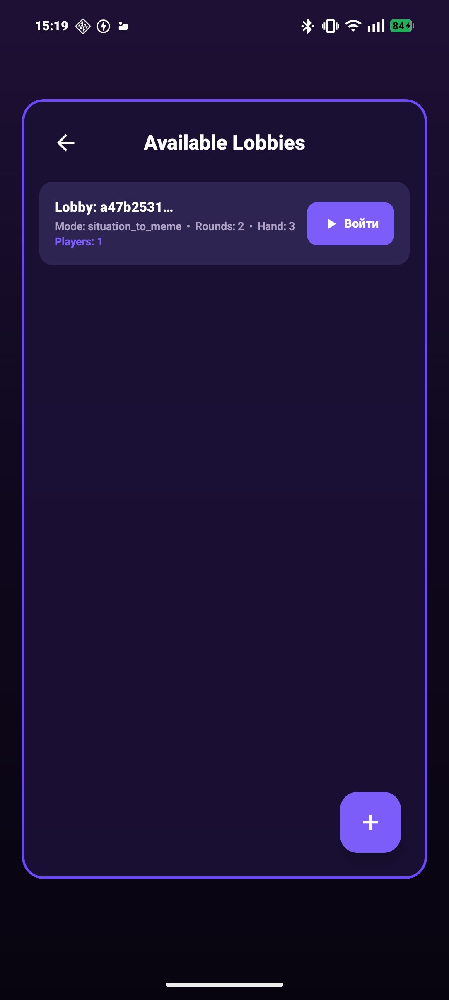
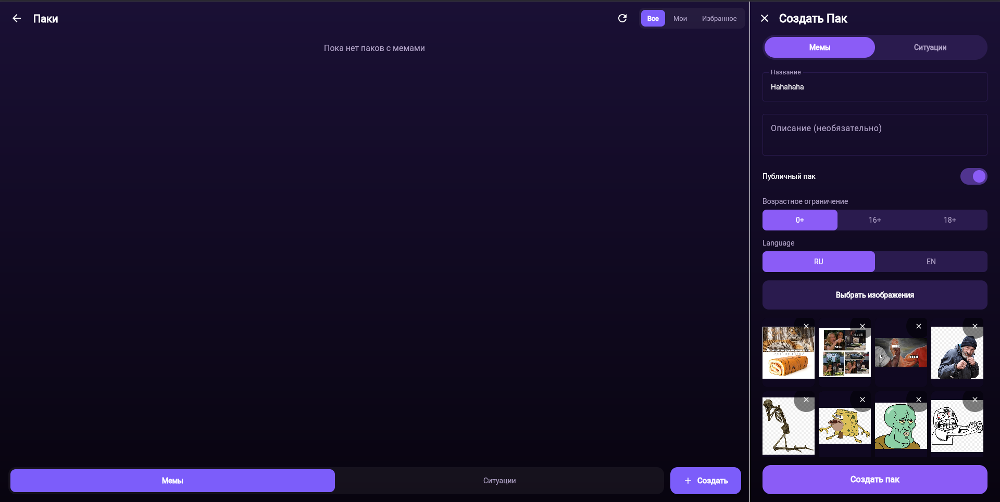
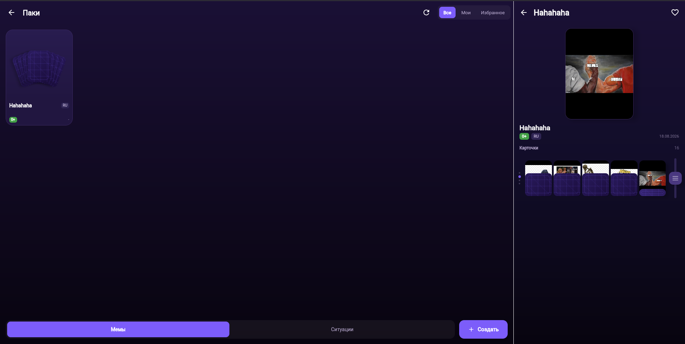
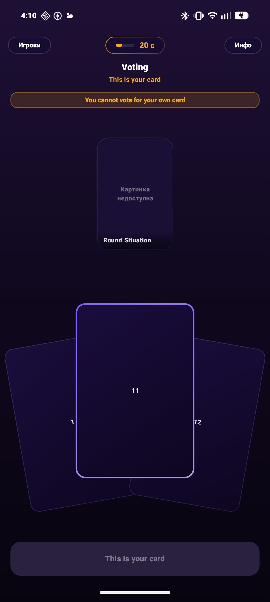

# 🃏 Meme Battle

<div align="right">
  <a href="README.md">🇬🇧 Read in English</a>
</div>

**Meme Battle** — это мультиплеерная карточная игра, в которой побеждает тот, кто лучше всех умеет подбирать мемы к ситуациям. Вдохновлена концепцией Cards Against Humanity, но целиком построена на мемах и пользовательском контенте.

---

## 🎮 Как это работает

Игроки собираются в лобби, выбирают колоды и запускают партию. В каждом раунде на экране появляется **ситуация** — текстовая или медиа-карточка. Каждый участник втайне выбирает **мем** из своей руки, который, по его мнению, лучше всего подходит к ситуации. После того как все подали карты, начинается **голосование** — игроки анонимно выбирают лучший ответ. Тот, за чью карту проголосовало большинство, получает очко раунда. Побеждает набравший больше всего очков по итогам всех раундов.

---

## ✨ Ключевые особенности

- **Два игровых режима**
  - *Ситуация → Мем* — к ситуации нужно подобрать подходящий мем
  - *Мем → Ситуация* — наоборот: к мему придумывается контекст

- **Пользовательские паки**
  Любой игрок может создать собственный пак мемов или ситуаций, загрузить изображения, задать возрастное ограничение и язык. Паки можно публиковать для всего сообщества или держать приватными.

- **Лобби с настройками**
  Создавай лобби с нужным количеством раундов и размером руки, выбирай паки — и жди друзей. Публичные лобби видны всем желающим присоединиться.

- **Анонимное голосование**
  Карты во время голосования не привязаны к никам — исход определяется качеством мема, а не авторитетом игрока.

- **Адаптивный UI**
  Интерфейс автоматически подстраивается под размер экрана: на десктопе и планшете панели «Игроки» и «Инфо» всегда видны по бокам, на мобильном — выезжают по нажатию.

- **Кроссплатформенность**
  Приложение работает на **Android** и в **браузере** (WasmJS) из одной кодовой базы на Kotlin Multiplatform.

---

## 📸 Скриншоты

### Игровой процесс — веб

| Выбор карты | Голосование | Итоги раунда |
|:-:|:-:|:-:|
|  |  |  |

### Лобби и ожидание

| Ожидание игроков (веб) | Список лобби (Android) |
|:-:|:-:|
|  |  |

### Каталог паков

| Каталог | Детали пака |
|:-:|:-:|
|  |  |

### Мобильный клиент

<div align="center">
  
</div>

---

## 🛠 Стек технологий

| Слой | Технология |
|---|---|
| Язык | Kotlin Multiplatform |
| UI | Compose Multiplatform |
| Архитектура | MVI (Decompose + MVIKotlin) |
| DI | Koin |
| Сеть | Ktor + WebSocket (Centrifugo) |
| Таргеты | Android, WasmJS |

---

## 🗂 Структура проекта

```
MemeBattle/
├── app/                  # Android точка входа
├── webApp/               # WasmJS точка входа
├── shared/               # Общий DI и навигация
├── core/
│   ├── localization/     # Ресурсы строк (EN / RU)
│   ├── ui/               # Общие UI-компоненты
│   └── ...
├── feature/
│   ├── home/             # Главный экран и лобби
│   ├── gameplay/         # Игровой процесс
│   └── packs/            # Управление паками
└── network/              # Сетевые клиенты и DTO
```

---

## 🚀 Запуск веб-версии в Docker

Сборка и запуск веб-версии (WasmJS) в контейнере Nginx:

```bash
# Запуск через Docker Compose
docker compose up --build -d
```

Приложение будет доступно по адресу `http://localhost:8080`.

