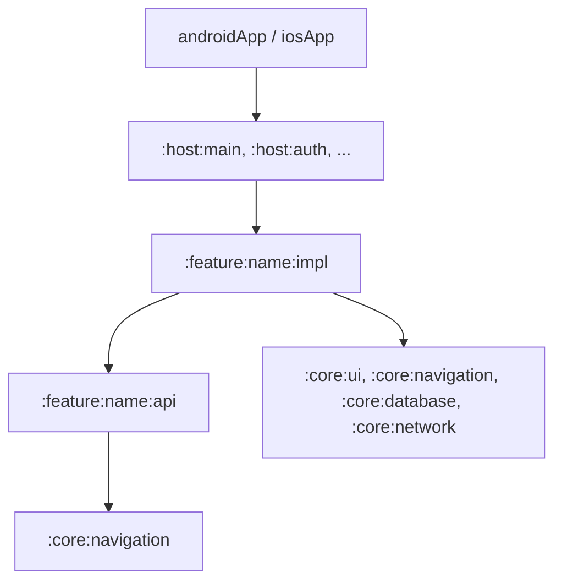

# Архитектура проекта KMP (MemeBattle)

Данный документ описывает целевую архитектуру, структуру модулей и концепцию навигации Kotlin Multiplatform (KMP) проекта. Цель этой архитектуры — обеспечить изоляцию бизнес-логики, масштабируемость разработки, быструю сборку и предсказуемый жизненный цикл компонентов на всех платформах.

---

## 1. Карта модулей приложения (Модульная структура)

Проект разделен на логические слои модулей по принципу слабой связанности (Loose Coupling):



### Группы модулей:

1. **`App-клиенты` (`:androidApp`, Xcode-проект `:iosApp`)**
   - Тонкие платформенные оболочки.
   - Содержат только точки запуска приложения, инициализируют глобальный DI-граф (Koin) и передают управление базовым хостам.
2. **`Хосты` (`:host:main`, `:host:auth`, ...)**
   - Объединяют экраны и фичи в крупные логические блоки (слои приложения).
   - Например, `:host:main` содержит FloatingBar, обрабатывает переключение табов и управляет оверлеями.
3. **`Фичи` (`:feature:X:api` и `:feature:X:impl`)**
   - Самодостаточные функциональные блоки (например, `:feature:profile`, `:feature:chat`).
4. **`Ядро` (`:core:Y`)**
   - Системные и инфраструктурные модули, переиспользуемые во всем проекте.

### Распределение системных компонентов по core-модулям:
- **`:core:navigation`** — маршруты (`AppRoute`), контракты точек входа (`FeatureEntry`), логика слоев (`HostLayer`).
- **`:core:ui`** / **`:core:designsystem`** — цветовые палитры (Light/Dark themes), шрифты, формы, анимации, переиспользуемые Compose-виджеты.
- **`:core:network`** — общая настройка Ktor-клиента, базовые модели ответов, обработка ошибок сети, авторизационные интерцепторы.
- **`:core:database`** — базы данных и локальное хранилище. Для KMP-проектов рекомендуется выбор из:
  - **SQLDelight** (для реляционных данных) — генерирует типобезопасный Kotlin API из чистых `.sq` файлов, легок и стабилен на iOS/Android без тяжелого KSP.
  - **DataStore / MultiplatformSettings** (для ключ-значение прогресса, настроек) — легковесное решение без SQLite.
- **`:core:utils`** — базовые хелперы, расширения (Extensions) для Kotlin/Coroutines, платформенные утилиты.
- **`:core:localization`** — ресурсы локализации (строки, переводы, поддержка языков).

---

## 2. Концепция KMP-модулей: как это устроена на платформах

В Kotlin Multiplatform **нет необходимости дублировать Gradle-модули под каждую платформу**. Каждый модуль является единым KMP-модулем, внутри которого Gradle разделяет код по исходным сетам (Source Sets):

```
my-module/
├── build.gradle.kts           # Конфигурация таргетов (Android, iOS и т.д.)
└── src/
    ├── commonMain/            # > 90% кода: Бизнес-логика, Compose UI, DI, Stores
    ├── androidMain/           # Платформенный код для Android (Android Context, SharedPreferences)
    ├── iosMain/               # Платформенный код для iOS (Apple API, native Frameworks)
    └── desktopMain/           # Платформенный код для Desktop (JVM, File IO)
```

### Основные правила разработки KMP-модулей:
1. **Максимум в `commonMain`**: UI (Compose Multiplatform), бизнес-логика (MVIKotlin, Coroutines) и внедрение зависимостей (Koin) пишутся один раз в `commonMain`.
2. **Интеграция платформенного API**: Если модулю требуется доступ к возможностям ОС (например, Keychain в iOS и Keystore в Android):
   - В `commonMain` объявляется интерфейс или `expect class`.
   - В `androidMain` и `iosMain` пишется реализация (`actual`).
3. **Отсутствие дублирования**: Вы создаете один Gradle-модуль (например, `:core:database`), подключаете плагин KMP, и на выходе компилятор генерирует `.aar` для Android и `.framework` для iOS.

---

## 3. Внутренняя структура фичи (Бизнес-слой)

Для фичи создается папка-контейнер, разделенная на два полноценных Gradle-модуля:

```
:feature:profile/
├── :api/                      # Публичный интерфейс фичи (зависит только от :core:navigation)
└── :impl/                     # Внутренняя реализация (зависит от своего :api и других :api)
```

### Разделение внутри `:impl` модуля:
Внутри `:impl` модуля слои Clean Architecture разделяются **пакетами**, а не новыми Gradle-модулями. Это исключает избыточность конфигураций и ускоряет сборку.

```
:feature:profile:impl/src/commonMain/kotlin/
├── data/
│   ├── repository/            # Реализация репозиториев
│   └── network/               # Ktor-сервисы, DTO модели
├── domain/
│   ├── model/                 # Чистые сущности бизнеса
│   └── usecase/               # Сценарии использования (одно действие)
└── presentation/
    ├── component/             # Decompose-компоненты (State holders)
    ├── store/                 # MVIKotlin Stores (MVI стейт-машина)
    └── view/                  # UI Экраны (Compose)
```

---

## 4. Конвенционные плагины (build-logic)

Чтобы избежать дублирования сотен строк конфигурации Gradle в каждом модуле, используется система **Convention Plugins** в каталоге `build-logic`.

Каждый модуль применяет готовый плагин одной строкой:

- `id("kmp.dev.library")` — автоматически настраивает KMP-таргеты (Android + iOS), задает SDK-версии, настраивает компилятор и базовые зависимости.
- `id("kmp.dev.compose")` — подключает Compose Multiplatform и Compiler-плагин.
- `id("tech.dev.mvikotlin")` — подключает MVIKotlin зависимости.
- `id("tech.dev.room")` — подключает Room и KSP для генерации БД.

---

## 5. Типобезопасная навигация на Decompose (Feature Entry System)

Для обеспечения типобезопасности и исключения runtime-кастов при рендеринге экранов, вводится маркерный интерфейс для всех Decompose-компонентов — `FeatureComponent`.

### Контракт навигации:

```kotlin
// В :core:navigation
interface FeatureComponent

// Маркерный интерфейс для стирания типов при хранении в коллекциях хоста
interface AnyFeatureEntry {
    val routeClass: KClass<out AppRoute>
    
    @Composable
    fun RenderAny(component: FeatureComponent)
}

// Типобезопасная точка входа в фичу
interface FeatureEntry<R : AppRoute, out C : FeatureComponent> : AnyFeatureEntry {
    val baseRoute: R
    
    override val routeClass: KClass<out AppRoute>
        get() = baseRoute::class

    fun create(route: R, componentContext: ComponentContext): C

    @Composable
    fun Render(component: @UnsafeVariance C)

    @Suppress("UNCHECKED_CAST")
    @Composable
    override fun RenderAny(component: FeatureComponent) {
        Render(component as C)
    }
}
```

### Абстрактный хелпер для реализации фичи:
```kotlin
abstract class TypedFeatureEntry<R : AppRoute, C : FeatureComponent> : FeatureEntry<R, C> {
    abstract fun createTyped(route: R, componentContext: ComponentContext): C
    
    @Composable
    abstract fun RenderTyped(component: C)

    final override fun create(route: R, componentContext: ComponentContext): C = 
        createTyped(route, componentContext)

    @Composable
    final override fun Render(component: C) {
        RenderTyped(component)
    }
}
```

### Использование в хосте (стирание типов):
Хост оперирует списком `List<AnyFeatureEntry>`. При переходе он создает компонент через `entry.create(...)` (тип стирается до `FeatureComponent`) и безопасно отрисовывает экран через `entry.RenderAny(component)`.

---

## 6. Организация DI через Koin

Внедрение зависимостей настраивается на трех уровнях для обеспечения жестких границ видимости компонентов.

### Иерархия DI:

1. **Глобальный уровень (`KitScope` / `GlobalScope`)**
   - Настраивается при запуске приложения в `androidApp` / `iosApp`.
   - Регистрирует общие клиенты (`Ktor`, `Database`), утилиты и список всех `FeatureEntry` для навигации.
2. **Уровень Хоста (`HostScope` / `FlowScope`)**
   - Привязан к крупным Decompose-компонентам (хостам).
   - Хранит навигационные стэки и контроллеры слоев (например, `BarController`).
3. **Экранный уровень (`ComponentScope`)**
   - Жизненный цикл Koin Scope жестко привязывается к Decompose-компоненту.
   - При уничтожении компонента Koin Scope автоматически закрывается:
     ```kotlin
     val componentScope = koin.createScope(scopeId, named<MyComponent>())
     componentContext.lifecycle.doOnDestroy { componentScope.close() }
     ```
   - Защищает от утечек памяти при переключении экранов.
