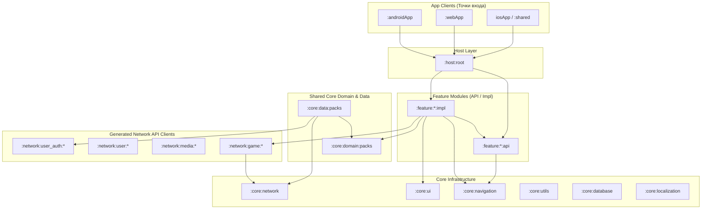

# Архитектура проекта KMP (MemeBattle)

Данный документ описывает актуальную целевую архитектуру, структуру модулей, организацию данных, систему навигации и концепцию разработки Kotlin Multiplatform (KMP) приложения **MemeBattle**.

Цель этой архитектуры — обеспечить изоляцию бизнес-логики, масштабируемость разработки, высокую скорость параллельной сборки и предсказуемый реактивный жизненный цикл компонентов на всех поддерживаемых платформах (Android, iOS, Web/WasmJS).

---

## 1. Карта модулей приложения (Модульная структура)

Проект разделен на логические слои модулей по принципу слабой связанности (**Loose Coupling**) и строгого инкапсулирования реализации:



### Группы модулей:

1. **App-клиенты (`:androidApp`, `:webApp`, Xcode-проект `iosApp` + `:shared`)**
   - Тонкие платформенные точки запуска приложения.
   - Инициализируют Koin DI (глобальный граф) и передают управление базовому хосту (`:host:root`).
   - Содержат специфичную платформенную конфигурацию (AndroidManifest, HTML/Wasm runner, iOS Framework export).

2. **Хост (`:host:root`)**
   - Точка сборки и координации навигационного графа всего приложения.
   - Управляет корневым Decompose-компонентом (`RootComponent`), навигационным стеком, глобальными оверлеями, всплывающими уведомлениями и всплывающими окнами (Modal/Dialogs).

3. **Фичи (`:feature:X:api` и `:feature:X:impl`)**
   - Самодостаточные функциональные блоки. В проекте выделены следующие фичи:
     - **`:feature:home`** — Главный экран, лобби, меню быстрой игры.
     - **`:feature:packs`** — Управление наборами мемов и ситуаций (каталог, детали, создание, редактирование, фильтры).
     - **`:feature:game-setup`** — Создание и настройка игровой комнаты, выбор паков, приглашение игроков.
     - **`:feature:gameplay`** — Игровой процесс (раунды, раздача карт, выбор мемов, голосование, таблица лидеров, синхронизация через WebSocket).

4. **Общий слой данных и бизнес-логики (`:core:domain:packs`, `:core:data:packs`)**
   - Единый источник истины (Single Source of Truth) для межфичевых данных.
   - Осуществляет реактивное кэширование и синхронизацию состояния паков через `StateFlow` между эдитором, каталогом и пред-игровой настройкой.

5. **Ядро инфраструктуры (`:core:Y`)**
   - **`:core:navigation`** — Контракты навигации (`FeatureEntry`, `TypedFeatureEntry`, `AppRoute`, `NavigationOutput`, `NavigationOutputHandler`).
   - **`:core:ui`** — Дизайн-система Compose Multiplatform (цветовые темы, шрифты, базовые компоненты, кнопки, карточки, диалоги, банеры уведомлений).
   - **`:core:network`** — Ktor HTTP клиент, авторизационные интерцепторы, хранение сессий/токенов, обертки сетевых ответов (`NetworkResult<T>`, `SafeCall`).
   - **`:core:localization`** — Ресурсы локализации (строки, переводы, Compose Resources `Res.string.*`).
   - **`:core:database`** — Абстракция локального хранения (Room / SQLDelight / Settings).
   - **`:core:utils`** — Вспомогательные утилиты, Coroutines dispatchers, расширения Kotlin.

6. **Network / Service API клиенты (`:network:Z`)**
   - Изолированные сетевые клиенты для конкретных доменов бэкенда:
     - `:network:user_auth:v1` / `:network:user_auth:current` — Аутентификация (гостевой вход, OAuth, обновление токенов).
     - `:network:user:v1` / `:network:user:current` — Профиль пользователя и управление аккаунтом.
     - `:network:media:v1` / `:network:media:current` — Загрузка и управление медиафайлами.
     - `:network:game:v1`, `:network:game:v2` / `:network:game:current` — Игровые эндпоинты и WebSocket сессии.

---

## 2. Концепция KMP-модулей и Платформенные Таргеты

Проект компилируется под 3 ключевые целевые платформы:
- **Android** (`JVM / Android Target`)
- **iOS** (`Native Arm64 / Simulator Target`)
- **Web** (`WasmJS Target`)

Каждый модуль является единым Multiplatform-модулем со следующей структурой исходников (Source Sets):

```
my-module/
├── build.gradle.kts           # KMP и Convention плагины
└── src/
    ├── commonMain/            # > 90% кода: UI (Compose), State Holders (Decompose), MVI Stores, Koin
    ├── androidMain/           # Платформенный код Android (Android Context, SharedPreferences / EncryptedStorage)
    ├── iosMain/               # Платформенный код iOS (NSUserDefaults, Native Keychain)
    └── wasmJsMain/            # Платформенный код WasmJS (Browser LocalStorage, Web APIs)
```

### Принципы платформенной изоляции:
1. **Основной код в `commonMain`**: Бизнес-логика, Compose UI, MVI-сторы и DI регистрируются один раз в `commonMain`.
2. **Платформенные абстракции (`expect / actual`)**: Для обращения к API операционных систем (безопасное хранение токенов авторизации, специфичные настройки сети):
   - В `commonMain` объявляется `expect interface` / `expect class` (например, `TokenStorage`).
   - В `androidMain`, `iosMain`, `wasmJsMain` предоставляются соответствующие `actual` реализации.

---

## 3. Внутренняя структура фичи (Clean Architecture в `:impl`)

Каждая фича разделена на публикационный интерфейсный модуль (`:api`) и внутренний модуль реализации (`:impl`):

```
:feature:packs/
├── :api/                      # Маршруты AppRoute, контракты точек входа FeatureEntry
└── :impl/                     # Внутренняя Clean Architecture
```

Внутри `:impl` модуля разделение по слоям происходит на уровне **пакетов**:

```
:feature:packs:impl/src/commonMain/kotlin/com/dev/memebattle/feature/packs/impl/
├── presentation/
│   ├── component/             # Decompose-компоненты (State Holders, обработка UI интентов)
│   ├── store/                 # MVIKotlin Stores (State, Intent, Action, Message, Executor, Reducer)
│   └── view/                  # Compose UI Экраны и виджеты
├── domain/
│   ├── model/                 # Модели данных фичи
│   ├── repository/            # Интерфейсы внутренних репозиториев
│   └── usecase/               # Сценарии использования
└── data/
    ├── repository/            # Реализации внутренних репозиториев
    └── network/               # Работа со специфичными DTO
```

---

## 4. Архитектурный стек и Управление Состоянием (MVIKotlin + Decompose)

### 4.1. Decompose (Архитектура компонентов)
- **Decompose** отвечает за иерархию компонентов, их жизненный цикл (`Lifecycle`) и сохранение состояния (`StateKeeper`, `InstanceKeeper`).
- При изменении конфигурации (например, поворот экрана на Android) Decompose сохраняет стэк компонентов и MVI-сторы через `InstanceKeeper`, предотвращая сброс пользовательского ввода или перезагрузку данных.

### 4.2. MVIKotlin (Паттерн MVI)
Каждый экран или фича управляется MVIKotlin Store, реализующим чистый MVI-цикл:
- **`Intent`** — Пользовательское действие из Compose UI.
- **`Action`** — Внутреннее начальное или фоновое действие (например, подписка на поток данных при запуске).
- **`Message`** — Мутация состояния, обрабатываемая Reducer'ом.
- **`State`** — Неизменяемое (Immutable) состояние экрана, считываемое в Compose UI как `StateFlow`.
- **`Label` / `Effect`** — Одноразовые события (навигация, вывод уведомлений, ошибок).

```
[ Compose View ] ---> ( Intent ) ---> [ Decompose Component ]
       ^                                    |
       |                                ( Intent )
    ( StateFlow )                           v
       |                           [ MVIKotlin Store ]
       +--- ( State Mutation ) <--- [ Reducer / Message ]
```

---

## 5. Типобезопасная Система Навигации (Feature Entry System)

Система навигации построена на паттерне **Feature Entry** поверх Decompose Stack Navigator.

### 5.1. Регистрация контрактов (`:core:navigation`)

```kotlin
// Маркерный интерфейс для Decompose-компонентов
interface FeatureComponent

// Маркерный интерфейс маршрута
interface AppRoute

// Типобезопасный контракт точки входа фичи
interface FeatureEntry<R : AppRoute, out C : FeatureComponent> {
    val baseRoute: R
    fun create(route: R, componentContext: ComponentContext): C
    @Composable fun Render(component: @UnsafeVariance C)
}
```

### 5.2. Цепочка обработки событий навигации (Navigation Output Pipeline)
Фичи не управляют навигатором напрямую. Вместо этого Decompose-компоненты отправляют выходящие события `NavigationOutput`:

- `NavigationOutput.NavigateTo(route)` — Переход на новый маршрут.
- `NavigationOutput.Back` — Возврат назад.
- `NavigationOutput.BringToFront(route)` — Подъем существующего экрана наверх.
- `NavigationOutput.PopAndBringToFront(route)` — Очистить стек и открыть экран.
- `NavigationOutput.ShowNotification(message, type)` — Глобальный показ уведомления.

Обработка осуществляется по паттерну **Chain of Responsibility** через зарегистрированные `NavigationOutputHandler`. Если локальный хендлер не обрабатывает событие, оно поднимается до `RootComponent`.

---

## 6. Единый Источник Истины и Реактивный Слой Данных (Packs / Gameplay Data)

Для предотвращения рассинхронизации данных между экранами (например, при редактировании пака в мемотеке и отображении его в каталоге или пред-игровой комнате) используется централизованный кэширующий репозиторий в `:core:data:packs`:

- **Single Source of Truth**: `PackRepositoryImpl` хранит горячее состояние паков в `MutableStateFlow<List<Pack>>`.
- **Реактивные мутации**: При отправке HTTP-запросов (`PATCH`, `DELETE`, `POST`) результат сразу обновляет локальный `StateFlow` кэш.
- **Мгновенный отклик UI**: Все экраны (`Catalog`, `Edit`, `Details`, `GameSetup`) подписаны на единый поток `PackRepository.observePacks()`, обеспечивая нулевой лаг обновления пользовательского интерфейса.

---

## 7. Сетевое Взаимодействие и WebSocket (Core Network & Services)

Сетевой слой абстрагирует работу с HTTP REST и WebSocket соединениями:

### 7.1. HTTP & SafeCall
- **Ktor Client** сконфигурирован в `:core:network` с поддержкой плагинов ContentNegotiation (kotlinx.serialization), Logging и Auth.
- Вызовы wrapping-функции `safeCall { ... }` возвращают строгий `NetworkResult<T>` (`Success`, `Error.Http`, `Error.Network`, `Error.Serialization`).

### 7.2. Безопасность и Аутентификация
- **`TokenStorage`**: Хранение JWT токенов (Access / Refresh) реализуется платформенно (`EncryptedSharedPreferences` в Android, `Keychain` в iOS, `WebStorage` в WasmJS).
- **`AuthInterceptor`**: Автоматически подставляет `Bearer` токен и выполняет бесшовный `Refresh Session` при получении ошибки `401 Unauthorized`.

### 7.3. Realtime Gameplay (WebSockets)
- Модули `:network:game` управляют устойчивым WebSocket-соединением для передачи игровой игровой сессии, состояния раундов, выбора карт и таймеров в реальном времени.

---

## 8. Внедрение Зависимостей (Koin DI Hierarchy)

Внедрение зависимостей организовано с использованием многоуровневой иерархии Koin Scopes, строго привязанной к жизненному циклу Decompose:

```
[ Global Koin Scope ] (App Startup: Ktor Client, TokenStorage, App Databases, Navigation Entries)
         │
         ├──► [ Host Scope ] (RootComponent, Navigation Stack Controllers)
                   │
                   └──► [ Component Scope ] (Feature Component + MVI Store)
                        * Автоматически закрывается при onDestroy компонента:
                        componentContext.lifecycle.doOnDestroy { componentScope.close() }
```

Эта структура гарантирует невозможность утечек памяти (Memory Leaks) компонентов UI и MVI-сторов при закрытии экранов.

---

## 9. Система Сборки и Gradle Convention Plugins (`build-logic`)

Для соблюдения единого стандарта модулей и устранения дублирования кода Gradle используется модуль `build-logic`.

Модули подключают унифицированные плагины:
- `id("kmp.dev.library")` — Базовая конфигурация Kotlin Multiplatform для Android, iOS, WasmJS.
- `id("kmp.dev.compose")` — Подключение Compose Multiplatform, UI засимостей и Compose Compiler.
- `id("tech.dev.mvikotlin")` — Подключение библиотек MVIKotlin и Coroutine integration.
- `id("tech.dev.room")` — Подключение Room БД и KSP обработчиков.

Для автогенерации структуры новых фичей в корне проекта доступен утилитарный скрипт `refactor.py`.

---

## 10. Резюме архитектурных принципов MemeBattle

1. **Строгая модульность**: Публичные контракты в `:api`, закрытая реализация в `:impl`.
2. **Единый код на 90%+**: Использование Compose Multiplatform + Decompose + MVIKotlin в `commonMain`.
3. **Безопасная навигация**: Отсутствие прямой связанности между экранами; использование `FeatureEntry` и `NavigationOutput`.
4. **Выживаемость UI стейта**: Decompose `InstanceKeeper` защищает состояние при поворотах и пересозданиях Activity.
5. **Реактивный Data Layer**: Репозитории являются единственным источником истины и распространяют данные через `StateFlow`.

